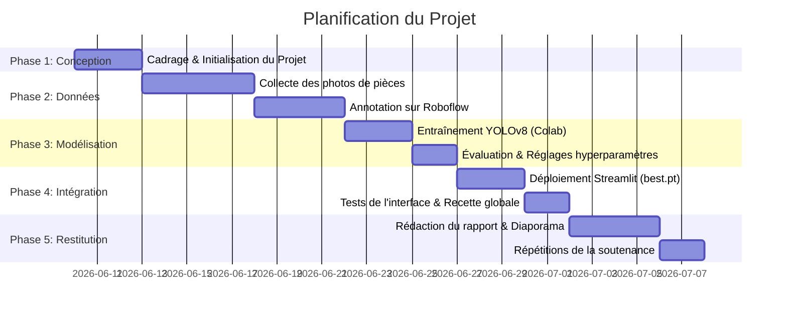

# Planification & Calendrier du Projet Académique

Ce document décrit l'organisation temporelle et les phases de réalisation du projet **"Moroccan Coins Detection and Total Amount Calculation"**.

## 1. Objectifs du Projet

Développer un système de vision par ordinateur capable de :
1. Détecter et localiser individuellement les pièces de monnaie marocaines (1 DH, 2 DH, 5 DH, 10 DH) sur une image.
2. Identifier le type de chaque pièce.
3. Calculer la somme totale en Dirhams (MAD).
4. Fournir une interface Streamlit interactive pour les utilisateurs.

---

## 2. Phases de Développement

Le projet est divisé en 5 phases majeures réparties sur un calendrier académique type :

### Phase 1 : Cadrage & Initialisation (Jours 1 à 3)
*   Définition de la charte de nommage des classes (`coin_1dh`, `coin_2dh`, `coin_5dh`, `coin_10dh`).
*   Création de la structure du projet et configuration de l'environnement virtuel.
*   Conception de l'interface Streamlit avec le simulateur.

### Phase 2 : Collecte & Annotation des Données (Jours 4 à 12)
*   **Acquisition :** Prise de 100 à 200 photos de pièces (différentes configurations de fond, angles, luminosité et mélanges).
*   **Annotation :** Téléversement des photos brutes sur Roboflow, tracé des boîtes englobantes et partitionnement des données (Train 70%, Valid 20%, Test 10%).

### Phase 3 : Entraînement & Optimisation Deep Learning (Jours 13 à 17)
*   Importation du dataset depuis Roboflow dans le notebook Google Colab.
*   Entraînement de YOLOv8 (modèle YOLOv8s ou YOLOv8n) sur 50 à 100 époques.
*   Analyse des courbes d'entraînement (perte, précision, rappel, mAP50, mAP50-95).
*   Téléchargement du fichier de poids optimal `best.pt`.

### Phase 4 : Intégration & Recette (Jours 18 à 22)
*   Déploiement du modèle dans le répertoire `models/` de l'application Streamlit.
*   Désactivation du mode simulation au profit de l'inférence réelle YOLOv8.
*   Tests approfondis sur le dossier `data/test_images` pour valider la robustesse aux ombres, reflets et orientations.

### Phase 5 : Livrables & Préparation de la Soutenance (Jours 23 à 28)
*   Rédaction du rapport final de projet en détaillant les métriques obtenues.
*   Création des supports visuels de présentation (slides).
*   Simulation orale devant les pairs pour se préparer aux questions du jury.

---

## 3. Livrables Attendus pour l'Évaluation

1.  **Code Source Git :** Un dépôt propre contenant l'application structurée.
2.  **Dataset annoté :** Lien vers le projet Roboflow public ou partagé.
3.  **Fichier de poids :** `best.pt` fonctionnel.
4.  **Notebook Colab :** Le journal d'entraînement `train_yolo_colab.ipynb` avec ses sorties d'exécution.
5.  **Rapport de Projet :** Synthèse écrite de la méthodologie et des résultats.
6.  **Soutenance :** Présentation orale avec démonstration en direct de l'interface Streamlit.
